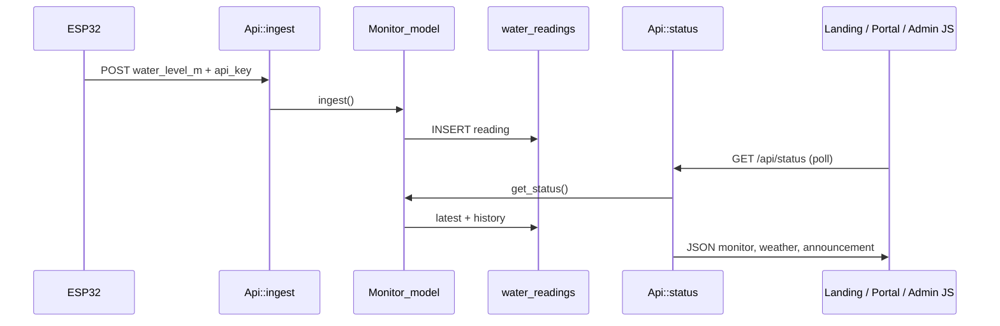
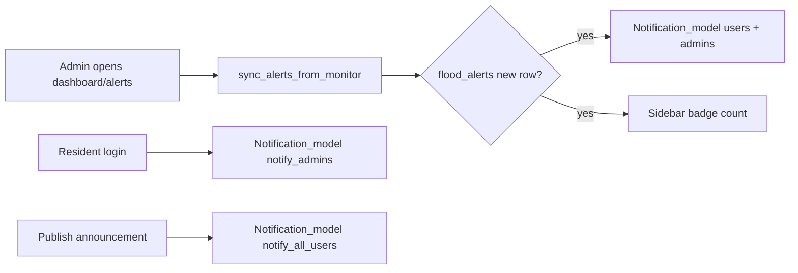
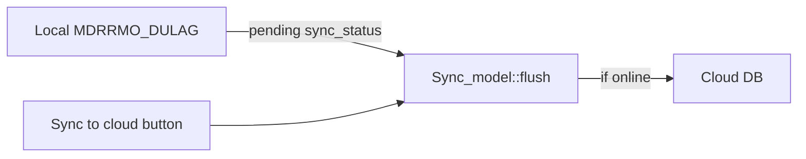

# Daguitan Flood Monitoring System — Study Guide

This document maps **routes**, **buttons/links**, **controllers**, **models**, **views**, **APIs**, and the **database** so you can study how the project works from the public site through admin and resident portals.

---

## 1. Big picture

| Layer | Technology | Role |
|--------|------------|------|
| Framework | CodeIgniter 3 (PHP) | MVC: URL → Controller → Model → View |
| Local DB | MySQL `MDRRMO_DULAG` | Users, readings, alerts, announcements, notifications |
| Cloud DB | MySQL (e.g. `MDRRMO_DULAG_CLOUD`) | Copy of pending rows when internet is up |
| Field device | ESP32 + JSN-SR04T | POST water level to `api/ingest` |
| Front-end | `landing.css`, `app.css`, JS | Public landing, resident portal, polling |

**Typical base URL (XAMPP):**

`http://localhost/Flood_Monitoring_In_Daguitan_Bridge/index.php/`

Some links use `site_url()` which includes `index.php` depending on config.

---

## 2. User roles and where they go

| Role | How they sign in | After login | Session `auth_role` |
|------|------------------|-------------|---------------------|
| **Guest** | — | Public landing `/` | (empty) |
| **Resident** | `/login` or `/signup` | `/portal` | `user` |
| **Admin (MDRRMO)** | `/admin` (admin login form) | `/admin` dashboard | `admin` |

**Session keys** (set on login, cleared on logout):

| Key | Meaning |
|-----|---------|
| `auth_user` | Username string |
| `auth_name` | Display name |
| `auth_role` | `admin` or `user` |
| `auth_phone` | Mobile (residents) |
| `auth_uid` | UUID `record_uid` in DB |
| `auth_id` | Numeric `users.id` (notifications, reads) |

**Logout:** `/logout` → `Auth::logout()` → destroys session → redirect `/`.

---

## 3. Route map (all custom routes)

Defined in `application/config/routes.php`. Order matters: specific routes before wildcards.

### Public & auth

| URL path | Controller::method | Purpose |
|----------|----------------------|---------|
| `/` (default) | `Welcome::index` | Public landing page |
| `/login`, `/login/resident` | `Auth::login` | Resident sign-in (POST → portal) |
| `/signup`, `/register` | `Auth::signup` | Resident registration (POST → portal) |
| `/logout` | `Auth::logout` | Sign out |
| `/portal` | `Portal::index` | Resident dashboard (requires `auth_role === user`) |
| `/admin` | `Admin::index` | Admin login OR dashboard if already admin |

### Admin (wildcard)

| URL path | Controller::method | Notes |
|----------|----------------------|--------|
| `/admin/sync` | `Admin::sync` | POST — flush pending rows to cloud |
| `/admin/history_export` | `Admin::history_export` | GET — CSV download |
| `/admin/reports_export` | `Admin::reports_export` | GET — CSV report |
| `/admin/residents_export` | `Admin::residents_export` | GET — CSV residents |
| `/admin/alert_acknowledge_all` | `Admin::alert_acknowledge_all` | POST only |
| `/admin/{page}` | `Admin::{page}` | e.g. `live`, `history`, `settings` |
| `/admin/{action}/{id}` | `Admin::{action}` | e.g. `alert_acknowledge/5` |

### API (JSON)

| URL path | Controller::method | Auth | Purpose |
|----------|----------------------|------|---------|
| `/api/status` | `Api::status` | None | Live monitor + weather + sync summary |
| `/api/monitor/status` | `Api::status` | Alias | Same as status |
| `/api/ingest` | `Api::ingest` | API key | ESP32 posts readings |
| `/api/sync` | `Api::sync` | None | Flush + status (JSON) |
| `/api/notifications` | `Api::notifications` | Session | List in-app notifications |
| `/api/notifications/read` | `Api::notifications_read` | Session | POST `id` — mark one read |
| `/api/notifications/read_all` | `Api::notifications_read_all` | Session | POST — mark all read |

---

## 4. Public landing (`Welcome` + `landing.php`)

**Controller:** `application/controllers/Welcome.php`  
**View:** `application/views/landing.php`  
**Model:** `Monitor_model::get_status()` for live water level, announcement, weather.

### Buttons / links → destination

| UI element | Goes to | Type |
|------------|---------|------|
| Sign in | `site_url('login')` → `/login` | Link |
| Sign up | `site_url('signup')` → `/signup` | Link |
| Signed-in name (admin) | `site_url('admin')` | Link |
| Signed-in name (user) | `site_url('portal')` | Link |
| Sign out | `site_url('logout')` | Link |
| Nav anchors `#home`, `#monitor`, `#alerts`, … | Same page scroll | Hash |
| View Live Status | `#monitor` | Hash |
| Notify button (landing) | `#alerts` | Hash (public has no bell API) |

**JS:** `assets/js/landing.js` polls `status_url` (`/api/status`) every few seconds.

---

## 5. Auth pages

### Resident login — `Auth::login` + `auth/login.php`

| Action | Method | Target | Result |
|--------|--------|--------|--------|
| Submit form | POST | `site_url('login')` | `Auth_model::verify` → `record_login` → session → redirect `portal` |
| Sign up tab | GET | `/signup` | Signup page |
| Back to site | GET | `/` | Landing |

### Resident signup — `Auth::signup` + `auth/signup.php`

| Action | Method | Target | Result |
|--------|--------|--------|--------|
| Submit form | POST | `site_url('signup')` | `register_resident` → notify admins → `record_login` → `portal` |
| Sign in tab | GET | `/login` | Login page |

### Admin login — `Admin::index` + `auth/admin_login.php`

| Action | Method | Target | Result |
|--------|--------|--------|--------|
| Submit form | POST | `site_url('admin')` | Verify + `role === admin` → session → redirect `admin` (dashboard) |
| Return to public | GET | `/` | Landing |

**Note:** `/login?role=admin` redirects to `/admin`.

---

## 6. Resident portal (`Portal` + `dash/portal.php`)

**Gate:** `Portal::__construct` redirects to `/login` if not `auth_role === user`.

| UI | Behavior |
|----|----------|
| Notification bell | `partials/notifications_bell.php` + `notifications.js` → `/api/notifications` |
| Sign out | `/logout` |
| Bottom nav / drawer | In-page `#home`, `#monitor`, `#guidance`, `#alerts`, `#safety` |
| Public site link | `/` |

**Data:** `Monitor_model::get_status()`; guidance text depends on `warning_level` (green/yellow/red).

**JS:** `landing.js` + `window.DAGUITAN.statusUrl` → same API as public site.

---

## 7. Admin portal — sidebar navigation

**Controller:** `application/controllers/Admin.php`  
**Layout:** `application/views/dash/admin/layout.php`  
**Pages:** `application/views/dash/admin/pages/{section}.php`  
**Model (most pages):** `Admin_portal_model::portal_context()` + page-specific methods.

Sidebar is built from `$nav` in `Admin.php`:

| Sidebar label | `href` key | URL | Controller method | View file | Main function |
|---------------|------------|-----|-------------------|-----------|----------------|
| Dashboard | `admin` | `/admin` | `dashboard()` | `dashboard.php` | KPIs, chart, recent readings, sign-ins |
| Live Monitoring | `admin/live` | `/admin/live` | `live()` | `live.php` | Live metrics + hardware + weather |
| Monitoring History | `admin/history` | `/admin/history` | `history()` | `history.php` | Filtered table of readings |
| Flood Alerts | `admin/alerts` | `/admin/alerts` | `alerts()` | `alerts.php` | Active + history alerts, acknowledge |
| Analytics | `admin/analytics` | `/admin/analytics` | `analytics()` | `analytics.php` | Charts + stats by date range |
| Sensor Status | `admin/sensors` | `/admin/sensors` | `sensors()` | `sensors.php` | ESP32 / connectivity cards |
| Announcements | `admin/announcements` | `/admin/announcements` | `announcements()` | `announcements.php` | CRUD + publish |
| Residents | `admin/residents` | `/admin/residents` | `residents()` | `residents.php` | User list + login stats |
| Reports | `admin/reports` | `/admin/reports` | `reports()` | `reports.php` | Printable snapshot |
| Settings | `admin/settings` | `/admin/settings` | `settings()` | `settings.php` | Thresholds → JSON file |
| Logout (footer) | — | `auth/logout` | `Auth::logout` | — | End session |

**Header (every admin page):**

| Button | Method | URL | Function |
|--------|--------|-----|----------|
| Notification bell | — | API | In-app notifications |
| Public site | GET | `/` | Landing |
| Sync to cloud | POST | `/admin/sync` | `Sync_model::flush()` → flash message → redirect back (`return_to`) |

---

## 8. Admin pages — buttons and actions (detail)

### Dashboard (`dashboard.php`)

| Control | Destination | Backend |
|---------|-------------|---------|
| Quick: Live monitoring | `/admin/live` | `live()` |
| Quick: Flood alerts | `/admin/alerts` | `alerts()` |
| Quick: Announcements | `/admin/announcements` | `announcements()` |
| Quick: Residents | `/admin/residents` | `residents()` |
| Quick: Full history | `/admin/history` | `history()` |
| Quick: Threshold settings | `/admin/settings` | `settings()` |
| Active alerts KPI link | `/admin/alerts` | — |
| View full history | `/admin/history` | — |
| Manage residents | `/admin/residents` | — |

Chart/KPIs poll `/api/status` via `admin-portal.js`.

### Live (`live.php`)

| Control | Destination |
|---------|-------------|
| Refresh now | JS poll only |
| Review flood alerts (if not green) | `/admin/alerts` |
| Publish advisory | `/admin/announcements` |

### History (`history.php`)

| Control | Method | URL | Function |
|---------|--------|-----|----------|
| Today / Last 7 days / Critical | GET | `/admin/history?...` | Query filters |
| Apply filters | GET | `/admin/history` | `date_from`, `date_to`, `warning` |
| Clear | GET | `/admin/history` | No query |
| Download CSV | GET | `/admin/history_export?...` | Up to 2000 rows CSV |

### Alerts (`alerts.php`)

| Control | Method | URL | Function |
|---------|--------|-----|----------|
| Acknowledge all active | POST | `/admin/alert_acknowledge_all` | Sets all `flood_alerts.status = acknowledged` |
| Acknowledge (one) | GET | `/admin/alert_acknowledge/{id}` | Single alert acknowledge |
| Live monitoring link | GET | `/admin/live` | — |
| Critical history link | GET | `/admin/history?warning=red` | — |

Alerts are **created** when admin opens dashboard/alerts: `Admin_portal_model::sync_alerts_from_monitor()`.

### Analytics (`analytics.php`)

| Tab | URL |
|-----|-----|
| Last 7 days | `/admin/analytics?days=7` |
| Last 30 days | `/admin/analytics?days=30` |
| Last 90 days | `/admin/analytics?days=90` |
| All stored data | `/admin/analytics?days=0` |

Uses `analytics_summary($since)`, `chart_series()`, `history_table()` with filters.

### Sensors (`sensors.php`)

| Control | Method | URL |
|---------|--------|-----|
| Force cloud sync | POST | `/admin/sync` |
| Open live monitoring | GET | `/admin/live` |
| Offline window settings | GET | `/admin/settings` |

### Announcements (`announcements.php`)

| Control | Method | POST fields | Function |
|---------|--------|-------------|----------|
| Save / Update | POST | `id`, `title`, `body`, `level`, `is_published` | `save_announcement()` |
| Publish | POST | `action=publish`, `id`, optional `send_push` | `toggle_announcement_publish(true)` → may notify residents |
| Unpublish | POST | `action=unpublish`, `id` | Unpublish |
| Delete | POST | `action=delete`, `id` | `delete_announcement()` |
| Edit | GET | `/admin/announcements?edit={id}` | Form prefill |

Published announcements override public announcement via `Monitor_model::published_announcement()`.

### Residents (`residents.php`)

| Control | Method | URL |
|---------|--------|-----|
| Search / filter | GET | `/admin/residents?q=&status=` |
| Clear | GET | `/admin/residents` |
| Download CSV | GET | `/admin/residents_export?...` |

`status`: `active` (signed in ≥1), `no_phone`.

### Reports (`reports.php`)

| Control | URL |
|---------|-----|
| Download CSV report | `/admin/reports_export` |
| Print | `window.print()` (browser) |

### Settings (`settings.php`)

| Control | Method | Storage |
|---------|--------|---------|
| Save settings | POST `/admin/settings` | `application/data/admin_settings.json` |

Overrides thresholds in `Monitor_model::cfg()` when file exists.

Fields: yellow/red thresholds (m), sensor height (cm), offline seconds, notification toggles (preferences only for future push/email).

---

## 9. Models — what each one does

| Model | File | Responsibility |
|-------|------|----------------|
| **Auth_model** | `Auth_model.php` | Login, signup, phone normalize, `user_logins` insert, seed users from `config/auth.php` |
| **Monitor_model** | `Monitor_model.php` | `get_status()`, `ingest()`, history, warning classification, announcements |
| **Sync_model** | `Sync_model.php` | Internet probe, pending rows, push to cloud DB, `flush()` |
| **Admin_portal_model** | `Admin_portal_model.php` | Admin UI data: history table, alerts, announcements, residents, analytics, settings JSON, ETT |
| **Notification_model** | `Notification_model.php` | `notifications` + `notification_reads`, bell API, events on login/signup/publish/alert |

---

## 10. Data flow diagrams

### ESP32 → display



### Admin alert + notification



### Hybrid sync



---

## 11. Database (`MDRRMO_DULAG`)

Full schema: `database/mdrrmo_dulag.sql`.  
Incremental scripts:

| File | Adds |
|------|------|
| `migrate_user_phone_and_logins.sql` | `users.phone`, `last_login_at`, `user_logins` |
| `migrate_admin_portal.sql` | `flood_alerts`, `announcements` |
| `migrate_notifications.sql` | `notifications`, `notification_reads` |
| `hybrid_sync.sql` | Cloud schema notes |

Tables are also **auto-created** on first use (`Admin_portal_model`, `Notification_model`, `Sync_model`).

### Table reference

| Table | Purpose | Key columns |
|-------|---------|-------------|
| **users** | Admins + residents | `username`, `phone`, `role`, `password_hash`, `sync_status` |
| **user_logins** | Audit each sign-in | `user_id`, `logged_in_at`, `ip_address` |
| **water_readings** | Sensor history | `water_level_m`, `received_at`, `sync_status` |
| **flood_alerts** | Threshold/offline alerts | `status` active/acknowledged, `warning_level` |
| **announcements** | MDRRMO advisories | `is_published`, `level` info/yellow/red |
| **notifications** | In-app bell | `audience` admin/user, `type`, `link`, `ref_id` |
| **notification_reads** | Per-user read state | PK (`notification_id`, `user_id`) |

### Warning levels (logic)

From `Monitor_model` / `Admin_portal_model` using thresholds:

| Level | Condition (water level) |
|-------|-------------------------|
| green (Safe) | &lt; yellow threshold |
| yellow (Monitor) | ≥ yellow and &lt; red |
| red (Critical) | ≥ red threshold |

Defaults in `application/config/monitor.php`; admin can override via `admin_settings.json`.

---

## 12. Config files worth knowing

| File | Purpose |
|------|---------|
| `config/routes.php` | URL aliases |
| `config/database.php` | Local MySQL connection |
| `config/monitor.php` | API key, thresholds, sensor height, offline window |
| `config/sync.php` | Cloud sync enable, probe, batch size |
| `config/auth.php` | Seed admin/resident accounts (dev) |
| `data/admin_settings.json` | Saved admin threshold/settings |
| `data/sync_probe.json` | Last internet probe cache |

---

## 13. Assets (JS/CSS)

| Asset | Used on | Role |
|-------|---------|------|
| `css/landing.css` | Landing, portal, auth, admin | Theme variables, layout |
| `css/app.css` | Same + notifications | Dashboard tables, notify panel |
| `css/admin-portal.css` | Admin only | Sidebar, admin layout |
| `css/auth.css` | Login/signup/admin login | Forms |
| `js/landing.js` | Landing, portal | Poll status, mobile nav |
| `js/admin-portal.js` | Admin | Chart, 5s poll, mobile sidebar |
| `js/notifications.js` | Admin + portal | Bell dropdown, mark read |
| `js/auth.js` | Auth pages | Password toggle, phone digits |

---

## 14. Notification types (study cheat sheet)

| `type` | Audience | When created |
|--------|----------|--------------|
| `user_login` | admin | Resident signs in |
| `user_signup` | admin | New resident registers |
| `admin_flood_alert` | admin | New row in `flood_alerts` |
| `announcement` | user | Announcement published |
| `flood_alert` | user | Yellow/red flood alert created |

---

## 15. File tree (application — study focus)

```
application/
  config/          routes, database, monitor, sync, auth
  controllers/
    Welcome.php    Public home
    Auth.php       login, signup, logout
    Portal.php     Resident portal
    Admin.php      MDRRMO admin portal
    Api.php        status, ingest, sync, notifications
  models/
    Auth_model.php
    Monitor_model.php
    Sync_model.php
    Admin_portal_model.php
    Notification_model.php
  views/
    landing.php
    auth/          login, signup, admin_login
    dash/
      portal.php
      admin/
        layout.php
        pages/     dashboard, live, history, ...
    partials/
      notifications_bell.php
  data/
    admin_settings.json
```

---

## 16. Quick practice questions

1. What URL does ESP32 call, and which config key must match the firmware?  
2. Where are flood alerts acknowledged, and which table updates?  
3. What happens when an admin publishes an announcement (DB + user UI)?  
4. Difference between `/api/status` and `Admin::live()`?  
5. Which file stores threshold overrides after saving Settings?  
6. Why does `Sync_model` exist if readings already save locally?

---

## 17. Default dev accounts (change in production)

From `application/config/auth.php`:

- **Admin:** username `MDRRMO_DULAG` (password in config file) → `/admin`  
- **Sample resident:** username in config → `/login` → `/portal`

---

*Last aligned with routes in `application/config/routes.php` and admin nav in `Admin.php`. Update this doc when you add new controllers or routes.*
